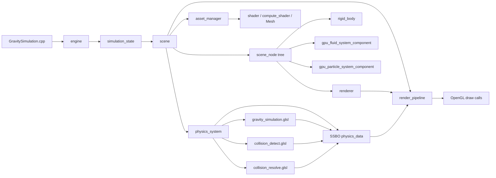

# GravitySimulation


A C++ / OpenGL sandbox for GPU-driven physics, procedural planets, fluids, cloth, collision debugging, and large-scale instancing.

The engine has moved beyond a single gravity demo: today the repository is best treated as a collection of **example scenes built on one reusable scene / render / physics stack**.

## Media gallery

### Cloth Simulation


### Particle system / instancing


### Fluid Simulation


### Videos
- Cloth Simulation: https://github.com/user-attachments/assets/d60c10da-0a40-4f57-ba22-afa23e51e2a7
- Particle System: https://github.com/user-attachments/assets/7a4f7264-bc39-4673-a578-41666a6a0235
- Fluid Simulation: https://github.com/user-attachments/assets/9d2cd7af-e0cb-4d01-bb04-46cdf4d02624

---

## What the engine currently contains

### Core runtime
- `engine` owns the GLFW window, main loop, and state switching.
- `simulation_state` is the playable runtime state and scene selector.
- `scene` owns the scene graph, physics system, asset manager, and runtime scene hooks.
- `scene_node` is the entity primitive; behaviour is attached through typed components.

### Rendering
- `renderer` components submit meshes + shaders to `render_pipeline`.
- `render_pipeline` batches by mesh / shader and uses instancing when possible.
- `asset_manager` creates and caches meshes, shaders, and compute shaders.
- `compute_shader` wraps OpenGL compute programs, SSBO upload/update, dispatch, and async readback.

### Physics / simulation
- `rigid_body` stores `physics_data` in a `std430`-friendly layout.
- `physics_system` groups bodies by compute shader and runs default gravity, custom compute passes, and collision stages.
- `gpu_fluid_system_component` and `gpu_particle_system_component` are higher-level GPU simulation components built on top of the same scene/runtime model.

---

## Example scenes

The runtime exposes multiple scenes through `simulation_state::example_scene_kind` and hot-switches them with function keys.

| Key | Scene | Main files | What it demonstrates |
|-----|-------|------------|----------------------|
| `F1` | **Fluid** | `fluid_scene.cpp`, `gpu_fluid_system_component.*`, `fluid_predict.glsl` | GPU particle fluid, debug visualizations, bounds handling, planetary-fluid extension hooks |
| `F2` | **Cloth** | `cloth_scene.cpp`, `cloth_simulation.glsl` | Constraint-based cloth, pinned particles, obstacle collisions, custom compute group assignment |
| `F3` | **Galactic** | `galactic_scene.cpp`, `galactic_simulation_test.cpp`, `gravity_simulation.glsl` | Solar-system style bodies, procedural planet rendering, ocean shell simulation, particle halo, representative engine integration |
| `F4` | **Galactic Stress** | `galactic_stress_scene.cpp` | Large body counts, instancing throughput, scene scale stress-testing |
| `F6` | **Collision Debug** | `collision_debug_scene.cpp`, `collision_detect.glsl`, `collision_resolve.glsl` | Broadphase / narrowphase visualization, contact generation, debug spawning, mixed GPU+CPU collision pipeline |

### Scene selection flow
- `GravitySimulation.cpp` currently boots into the **Fluid** scene by default.
- `simulation_state.cpp` lets you switch scenes live with `F1`, `F2`, `F3`, `F4`, and `F6`.
- Scene-specific debug keys are handled inside `simulation_state` and the concrete scene classes.

---

## Architecture overview



### Runtime responsibilities

| Layer | Responsibility | Key files |
|------|----------------|-----------|
| App bootstrap | Window creation, OpenGL init, state start | `GravitySimulation.cpp`, `engine.*` |
| Runtime state | Scene switching, input handling, frame orchestration | `simulation_state.*` |
| Scene model | Nodes, components, asset ownership, render hooks | `Scene.*`, `scene_node.*`, `Component.*` |
| Physics | Body grouping, compute dispatch, readback, collisions | `physics_system.*`, `rigid_body.*`, `physics_data.h` |
| Rendering | Batch submission, instancing, shader binding | `Renderer.*`, `render_pipeline.*`, `instance_manager.*` |
| Specialized systems | Fluid, particle, terrain, planetary water | `gpu_fluid_system_component.*`, `gpu_particle_system_component.*`, `planetary_*.*` |

---

## Most representative scene for extending your own forces

If you want to integrate **your own physical forces** with the smallest mental overhead, start with the **Galactic** scene and the default gravity compute path.

Why this scene is the best starting point:
- it uses the engine's default `rigid_body -> physics_system -> compute_shader -> renderer` path,
- the data layout is compact (`physics_data` = position + velocity + accumulated force),
- the compute shader is simple compared to the fluid and planetary water stack,
- you can replace gravity with any other force field without changing the whole engine architecture.

### Files to read first
- `GravitySimulation/physics_data.h`
- `GravitySimulation/rigid_body.cpp`
- `GravitySimulation/physics_system.cpp`
- `GravitySimulation/gravity_simulation.glsl`
- `GravitySimulation/galactic_simulation_test.cpp`

### Data flow in that scene
1. `galactic_simulation_test.cpp` creates the Sun, planets, and their `rigid_body` components.
2. Each `rigid_body` owns a `physics_data` struct.
3. `scene::register_in()` auto-registers bodies in `physics_system`.
4. `physics_system` uploads the bodies to SSBO binding `0` and dispatches `gravity_simulation.glsl`.
5. The compute shader integrates velocity and position on the GPU.
6. Updated positions are applied back to nodes, and `render_pipeline` draws the result.

### Minimal compute shader model used by the engine

`gravity_simulation.glsl` is intentionally readable:

```glsl
#version 460
layout(local_size_x = 64) in;

uniform float G;
uniform float dt;

struct PhysicsBody {
    vec4 position;
    vec4 velocity;
    vec4 accumulated_force;
};

layout(std430, binding = 0) buffer PhysicsData {
    PhysicsBody bodies[];
};

void main() {
    uint i = gl_GlobalInvocationID.x;
    if (i >= bodies.length()) return;

    vec3 pos = bodies[i].position.xyz;
    vec3 vel = bodies[i].velocity.xyz;
    vec3 acceleration = vec3(0.0);

    for (uint j = 0u; j < bodies.length(); ++j) {
        if (j == i) continue;
        vec3 dir = bodies[j].position.xyz - pos;
        float distSq = dot(dir, dir) + 25.0 * 25.0;
        float invDist = inversesqrt(distSq);
        float invDist3 = invDist * invDist * invDist;
        acceleration += G * bodies[j].position.w * dir * invDist3;
    }

    vel += acceleration * dt;
    pos += vel * dt;

    bodies[i].velocity.xyz = vel;
    bodies[i].position.xyz = pos;
}
```

### How to plug in your own forces

#### Option A — modify the default gravity kernel
Best when you want to keep using the standard physics path.

- Add uniforms or extra SSBO inputs to `gravity_simulation.glsl`.
- Compute your custom acceleration alongside or instead of gravity.
- Write the final velocity/position back into the same `PhysicsBody` buffer.
- Keep the `physics_data` memory layout unchanged so the engine-side upload/readback still works.

Examples of easy extensions:
- drag,
- central attraction / repulsion,
- magnetic-like directional fields,
- orbital correction terms,
- per-body custom forces stored in an additional SSBO.

#### Option B — create your own compute group
Best when only some bodies should use a different simulation rule.

- Create a new `compute_shader` asset.
- Register it with `scene::register_compute_shader(...)`.
- Assign bodies to it with `rigid_body::set_compute_shader(...)`.
- Let `physics_system` run that group as a custom GPU pass.

This is already how the cloth scene routes particles into `cloth_simulation.glsl`.

### Practical extension rules
- Treat `physics_data.position.w`, `velocity.w`, and `accumulated_force.w` as the body mass.
- Preserve `layout(std430)` compatibility between C++ and GLSL.
- Use the default Galactic path first; move to `fluid_predict.glsl` only after you need neighborhood queries, pressure, terrain masks, or planetary flow logic.

---

## Repository layout

```text
GravitySimulation/
├── GravitySimulation.sln
├── GravitySimulation/
│   ├── GravitySimulation.cpp
│   ├── engine.*
│   ├── simulation_state.*
│   ├── Scene.* / scene_node.* / Component.*
│   ├── Renderer.* / render_pipeline.* / instance_manager.*
│   ├── Shader.* / compute_shader.* / Mesh.*
│   ├── physics_system.* / rigid_body.* / physics_data.h / unit_system.*
│   ├── fluid_scene.* / gpu_fluid_system_component.* / fluid_predict.glsl
│   ├── cloth_scene.* / cloth_simulation.glsl
│   ├── galactic_scene.* / galactic_simulation_test.* / gravity_simulation.glsl
│   ├── galactic_stress_scene.*
│   ├── collision_debug_scene.* / collision_detect.glsl / collision_resolve.glsl
│   └── planetary_*.* / gpu_particle_system_component.* / terrain_*.*
└── PerformanceTests1/
```

---

## Controls

| Input | Action |
|-------|--------|
| `W` `A` `S` `D` | Move camera |
| Hold RMB + mouse move | Look around |
| `F1` / `F2` / `F3` / `F4` / `F6` | Switch example scene |
| `H` / `J` / `K` | Cycle debug modes depending on the active scene |
| `B` | Toggle bounding-box debug |
| `N` | Toggle collision debug overlay |
| `Esc` | Release camera focus / cancel interaction state |

---

## Requirements

| Dependency | Notes |
|------------|-------|
| **Windows x64** | Project is configured for Visual Studio 2022 / MSVC v143 |
| **OpenGL 4.6** | Required for compute shaders |
| **GLFW** | External dependency for windowing and input |
| **GLAD** | OpenGL loader headers / source must be available |
| **GLM** | Math library headers must be available |

> The vendored `glfw-3.4` directory has been removed from the repository. Use your local GLFW installation or package manager setup instead.

## Building

1. Open `GravitySimulation.sln` in **Visual Studio 2022**.
2. Make sure **GLFW**, **GLAD**, and **GLM** are available in the include/library paths used by `GravitySimulation.vcxproj`.
3. Build `Debug | x64` or `Release | x64`.
4. Run with the working directory set so shader paths like `GravitySimulation/*.shader` and `GravitySimulation/*.glsl` resolve correctly.

---

## Suggested reading order

If you are new to the codebase, read the project in this order:
1. `GravitySimulation.cpp`
2. `simulation_state.*`
3. `Scene.*` and `scene_node.*`
4. `physics_system.*` and `rigid_body.*`
5. `gravity_simulation.glsl`
6. `fluid_scene.*` / `cloth_scene.*` / `galactic_scene.*`

That path gives you the shortest route from app startup to your first custom GPU force.
